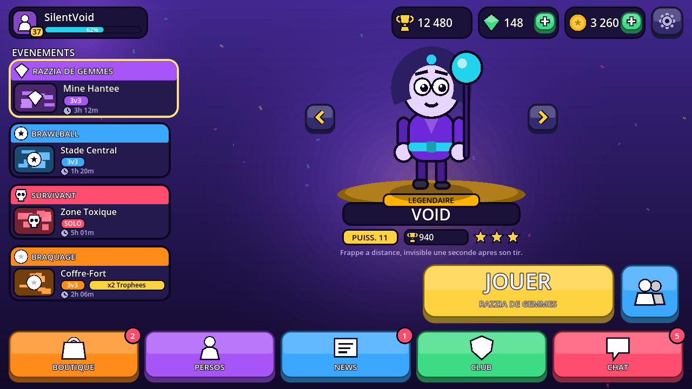

# SilentVoid Brawl — Lobby

Lobby de jeu mobile facon **Brawl Stars / Stumble Guys**, en **Godot 4**.
C'est la premiere brique du jeu : tout l'ecran d'accueil est jouable, la boucle
`lobby -> matchmaking -> partie -> lobby` fonctionne deja de bout en bout.



## Lancer le projet

1. Installe **Godot 4.3 ou plus recent** (https://godotengine.org/download) — version standard, pas .NET.
2. Godot > *Importer* > choisis le fichier `game/project.godot`.
3. Appuie sur **F5** (ou le bouton ▶ en haut a droite).

En ligne de commande :

```bash
godot --path game
```

## Ce qui est deja la

| Element | Detail |
| --- | --- |
| Bandeau du haut | profil + niveau + barre d'XP, trophees, gemmes, pieces, reglages |
| Boutons "+" | animent le compteur de la monnaie concernee (branche plus tard sur la boutique) |
| Colonne evenements | 4 modes de jeu, apercu de map, badge d'equipe, compte a rebours en temps reel |
| Scene centrale | le perso sur son estrade, animation d'idle (rebond, clignement, regard), fleches gauche/droite |
| Fiche perso | rarete, niveau de puissance, trophees, etoiles, perso verrouille avec son prix |
| Bouton JOUER | style Supercell (levre 3D, reflet, balayage lumineux, respiration) + nom du mode choisi |
| Barre du bas | Boutique / Persos / News / Club / Chat, avec pastilles de notification |
| Matchmaking | popup qui remplit les slots un par un, "VS" entre les deux equipes, annulation possible |
| Sauvegarde | perso et mode selectionnes + monnaies conserves entre deux lancements (`user://`) |

Le tout est **responsive** : la resolution de reference est 1280x720 en paysage,
et l'interface se reajuste a n'importe quelle taille d'ecran (`canvas_items` + `expand`).

## Zero asset a fournir

Toute la direction artistique est **dessinee en code** : icones vectorielles,
boutons, perso, estrade, confettis. Aucune image a importer, rien ne pixelise,
et changer une couleur se fait a un seul endroit.

Pour un rendu encore plus proche de Brawl Stars, depose une police dans
`assets/fonts/game.ttf` (voir `assets/fonts/LISEZ-MOI.md`).

## Organisation

```
game/
├── project.godot
├── autoload/
│   └── GameState.gd          # monnaies, persos, modes, sauvegarde (singleton)
├── scenes/
│   ├── Main.tscn             # racine : bascule lobby <-> partie
│   ├── ArenaStub.tscn        # ecran temoin de la partie (gameplay a venir)
│   └── lobby/Lobby.tscn      # squelette du lobby (editable a la souris)
└── scripts/
    ├── core/                 # Main.gd, ArenaStub.gd
    ├── ui/                   # briques reutilisables
    │   ├── UiSkin.gd         # PALETTE : toutes les couleurs du jeu
    │   ├── Painter.gd        # texte contoure, rectangles arrondis, halos, boutons
    │   ├── Icons.gd          # 20 icones vectorielles (trophee, gemme, gear, ...)
    │   ├── ChunkyButton.gd   # le bouton "Supercell" reutilisable partout
    │   └── CharacterView.gd  # le perso dessine (armes, chapeaux, animations)
    └── lobby/                # TopBar, EventPanel, BrawlerStage, PlayDock, BottomNav...
```

## Personnaliser

- **Couleurs** : `scripts/ui/UiSkin.gd`. Change `BG_TOP`/`BG_BOTTOM` et tout le jeu change d'ambiance.
- **Persos** : `GameState._build_brawlers()`. Chaque perso est un dictionnaire :
  couleurs (`suit`, `accent`, `skin`, `hair`), `weapon` (`gun`, `hammer`, `bow`, `staff`, `fist`),
  `hat` (`cap`, `helmet`, `hood`, `crown`, `hair`), rarete, puissance, trophees.
- **Modes de jeu** : `GameState._build_modes()` (nom, map, couleur, icone, nombre de joueurs, timer).
- **Mise en page** : ouvre `scenes/lobby/Lobby.tscn` dans Godot et deplace les zones
  (`TopBar`, `EventPanel`, `Stage`, `PlayDock`, `BottomNav`) ; chaque zone se remplit toute seule.

Les scripts d'interface sont en `@tool` : l'apercu est deja style dans l'editeur,
sans animation (donc sans consommer de CPU pendant que tu edites).

## Prochaines etapes

1. **Le gameplay** : remplacer `ArenaStub.tscn` par la vraie arene (deplacement au joystick, tir, degats).
2. **Ecran Persos** : la grille de selection complete derriere le bouton PERSOS.
3. **Boutique** : brancher les boutons "+" et l'achat du perso verrouille.
4. **Multijoueur** : remplacer le faux matchmaking par du vrai reseau (Godot `ENetMultiplayerPeer` ou serveur dedie).
