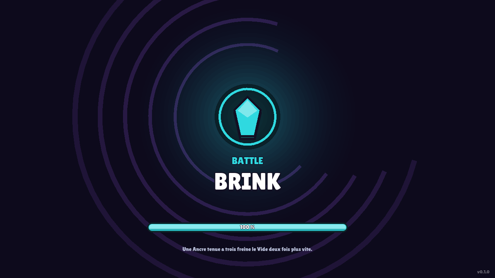
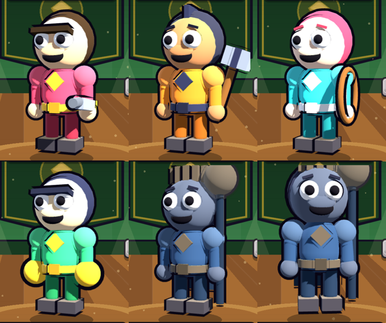

# Battle Brink

Jeu d'arene mobile en **Godot 4**. Le lobby est termine et jouable, les brawlers
sont en **3D**, le multijoueur fonctionne, et le jeu s'exporte en **APK Android**.

Le nom se change a un seul endroit : `GameState.TITLE_TOP` / `TITLE_MAIN`.




## Lancer

```bash
godot --path game          # ou : ouvrir game/project.godot dans Godot 4.4
```

## Construire

```bash
cd game
./build.sh apk     # -> build/SilentVoidBrawl.apk
./build.sh web     # -> build/web/index.html  (jouable au navigateur, mobile compris)
./build.sh linux   # -> build/SilentVoidBrawl.x86_64
```

Le script installe tout seul ce qui manque dans `game/.tools/` : Godot, les
templates d'export, le SDK Android, un **JDK 17** (Godot 4.4 refuse les autres
versions pour Android) et une cle de debug. Rien n'est installe sur le systeme.

> Note : au demarrage, Godot affiche `ObjectDB instances leaked at exit` (un
> objet). Ca vient de `ResourceLoader.load_threaded_request` utilise par l'ecran
> de chargement, c'est signale a l'extinction du moteur et sans effet sur le jeu.
>
> Piege rencontre : sans `textures/vram_compression/import_etc2_astc=true` dans
> `project.godot`, Godot refuse l'export Android **avec un message d'erreur vide**.
> Le reglage est deja en place ici.

## Le but du jeu

**Le Vide devore l'arene. On ne gagne pas en tuant, on gagne en gardant du terrain.**

C'est la seule regle qui compte, et elle change tout par rapport a un jeu de
frags : eliminer un adversaire ne rapporte aucun point, ca lui coute simplement
6 secondes de reapparition — donc du terrain. Le chrono, c'est le decor qui
disparait.

Les quatre modes en decoulent :

| Mode | Format | Objectif |
| --- | --- | --- |
| **ANCRAGE** | 3v3 | Tenir les Ancres : chacune freine le Vide chez toi et l'accelere en face. |
| **DERNIER SOUFFLE** | 10 joueurs solo | L'arene se referme. Une Balise a usage unique gele le Vide 8 s. |
| **FRACTURE** | 3v3 | Une seule Ancre. Le Vide pousse toujours vers l'equipe qui ne la tient pas. |
| **COLLECTE** | 3v3 | Ramener les Eclats recraches par le Vide. Mourir en fait tomber la moitie. |

Tout est decrit dans `GameState._build_modes()` : chaque mode porte son `goal` et
ses `rules`, affiches dans l'ecran de selection.

## L'interface

Elle suit l'organisation de Brawl Stars :

| Zone | Contenu |
| --- | --- |
| Haut gauche | pastille de niveau, carte joueur + club, trophees avec barre de rang |
| Haut droite | bandeau noir des monnaies (points de puissance, pieces, gemmes) + menu |
| Colonne gauche | BOUTIQUE, BRAWLERS, CLUB |
| Colonne droite | INFOS, AMIS, CHAT |
| Centre | le brawler sous les projecteurs, sa fiche au-dessus, les slots d'equipe |
| Bas gauche | passe de combat avec barre d'XP, quetes |
| Bas droite | carte d'evenement (ouvre le choix du mode) et gros bouton JOUER |

Le decor est une **arene couverte dessinee en code** : mur vert et lambris,
banniere emblematique, projecteurs et leurs cones de lumiere, plancher bois en
perspective, poussieres dans la lumiere, coins assombris.

## Ecran de chargement

Le jeu demarre sur un ecran de chargement (`scripts/core/LoadingScreen.gd`).
La barre n'est pas decorative : 60 % suivent le chargement reel des scenes,
40 % la tentative de connexion au serveur. Des astuces de jeu tournent en bas.

## Multijoueur

**Le joueur n'a aucune adresse a taper.** Le jeu se connecte tout seul au
demarrage et le bouton JOUER cherche une partie, comme dans Brawl Stars.

Pour que ca pointe vers ton serveur, une seule ligne a remplir dans
`autoload/Net.gd` :

```gdscript
const OFFICIAL_SERVER := "brawl.mondomaine.fr:8910"
```

Laisse vide et le jeu reste jouable : les parties se remplissent de bots.
Le panneau MULTIJOUEUR (bouton menu en haut a droite) affiche l'etat de la
connexion ; l'adresse personnalisee est repliee derriere « Utiliser mon serveur »,
pour ceux qui hebergent le leur.

Sous le capot, `autoload/Net.gd` gere :

```bash
# Heberger le serveur (aucune interface, tourne sur un VPS ou un PC)
godot --headless --path game -- --server 8910

# Forcer une adresse au lancement (debug)
godot --path game -- --join 192.168.1.20 8910
```

**La regle demandee est respectee** : on attend d'abord de vrais joueurs, et si
la file ne se remplit pas en 5 secondes, des bots prennent le relais pour que la
partie parte quand meme. Dans l'ecran de recherche, chaque bot porte un badge
`BOT` et le statut indique si tu es en ligne.

Test de bout en bout (un serveur + deux clients) :

```bash
godot --headless --path game -- --server 8910 &
godot --headless --path game res://scenes/dev/NetSmokeTest.tscn -- --join 127.0.0.1 --as Alice &
godot --headless --path game res://scenes/dev/NetSmokeTest.tscn -- --join 127.0.0.1 --as Bob
# [Alice] PARTIE TROUVEE : 2 humains + 4 bots -> Alice, Bob, Kyro53(bot), ...
```

## Les brawlers sont en 3D



Ils sont assembles a partir de formes primitives (spheres, capsules, boites)
par `scripts/brawler/BrawlerModel3D.gd` — aucun fichier de modele a fournir, et
un nouveau brawler ne demande qu'une entree de plus dans `GameState`.

Le rendu "cartoon" tient a une astuce : chaque piece porte une seconde passe de
materiau en **coque inversee** (`cull_front` + `grow`) peinte en noir. Ca dessine
un contour epais autour de toutes les silhouettes, exactement comme chez
Supercell. Trois lumieres completent le tableau : une principale chaude, une
d'appoint froide, et un contre-jour qui detache le brawler du decor.

Le tout est rendu dans un `SubViewport` a fond transparent (`BrawlerView3D`), pose
au milieu du lobby 2D : seul le brawler est en volume, le decor reste dessine.

Coiffes disponibles : `cap`, `helmet`, `hood`, `crown`, `hair` (queue de cheval).
Armes : `gun`, `hammer`, `bow`, `staff`, `fist`.

## Le premier brawler : VOID

| | |
| --- | --- |
| Role | ASSASSIN — legendaire |
| PV | 3600 |
| Attaque | **ECLAT DE NEANT** — trois eclats en cone, plus fort de pres (3 x 360) |
| Super | **FAILLE** — traverse les murs jusqu'au point vise, degats a l'arrivee |
| Gadget | **SILENCE** — inciblable 1 s et +1200 PV |
| Pouvoir stellaire | **OMBRE PORTEE** — invisible 1,5 s apres chaque Super |

Visuellement : capuche, cape qui ondule, epaulieres, emblème sur le torse, yeux
lumineux, baton a orbe. Tout est decrit dans `GameState._build_brawlers()` et
dessine par `scripts/ui/CharacterView.gd`.

Cinq autres brawlers accompagnent VOID (SHELDY, BRUTUS, NOVA, PIXO, et ZENTY
verrouille a 950 gemmes), chacun avec son role, ses stats et son apparence.

## Les boutons

Ils sont construits comme ceux de Supercell, pas comme des rectangles colores :

1. un contour sombre **teinte dans la couleur du bouton** (jamais du noir pur) ;
2. une **levre chaude** en dessous — la teinte glisse vers l'orange, elle n'est
   pas seulement assombrie : c'est ce liseré orange sous le jaune qui fait
   reconnaitre un bouton Brawl Stars ;
3. une face en **degrade vertical** doux ;
4. un **liseré clair** juste a l'interieur du bord ;
5. un texte blanc a gros contour **plus une ombre portee**.

Les coins restent volontairement peu arrondis (`rayon <= 26 % de la hauteur`) :
c'est ce qui distingue un bouton de jeu d'une pilule d'interface web. Tout est
dans `Painter.chunky()` et `UiSkin.rim() / lip() / inner()`.

Les onglets des bords n'utilisent pas ce bouton : ce sont des `IconTab`, une
tuile d'icone posee sur une plaque sombre. Varier les formes est ce qui enleve
l'effet "grille de boutons generes".

## Zero asset a fournir

Toute la direction artistique est **dessinee en code** : decor, icones, boutons,
brawlers. Aucune image a importer, rien ne pixelise. Seule exception, la police
**Lilita One** (licence OFL, dans `assets/fonts/`), qui donne le rendu de titre
typique du genre.

## Organisation

```
game/
├── project.godot
├── build.sh                  # APK / web / Linux en une commande
├── autoload/
│   ├── GameState.gd          # monnaies, brawlers, modes, passe, sauvegarde
│   └── Net.gd                # serveur, file d'attente, bots de remplacement
├── scenes/
│   ├── Main.tscn             # racine : bascule lobby <-> partie
│   ├── ArenaStub.tscn        # ecran temoin de la partie (gameplay a venir)
│   ├── lobby/Lobby.tscn      # squelette du lobby (editable a la souris)
│   └── dev/NetSmokeTest.tscn # test reseau sans interface
└── scripts/
    ├── core/                 # Main.gd, ArenaStub.gd
    ├── ui/
    │   ├── UiSkin.gd         # PALETTE : toutes les couleurs du jeu
    │   ├── Painter.gd        # ombres, cartes, bannieres, boutons, texte contoure
    │   ├── Icons.gd          # 22 icones vectorielles
    │   ├── ChunkyButton.gd   # le bouton "Supercell" reutilisable partout
    │   └── CharacterView.gd  # les brawlers dessines
    └── lobby/                # TopLeftBar, TopRightBar, SideTabs, BrawlerStage,
                              # BottomBar, ModePicker, NetPanel, Matchmaking...
```

## Personnaliser

- **Couleurs** : `scripts/ui/UiSkin.gd`. Change `HALL`/`FLOOR` et l'arene change d'ambiance.
- **Brawlers** : `GameState._build_brawlers()` — couleurs, arme (`gun`, `hammer`,
  `bow`, `staff`, `fist`), chapeau (`cap`, `helmet`, `hood`, `crown`, `hair`),
  `cape`, `glow_eyes`, plus les stats et le kit.
- **Modes de jeu** : `GameState._build_modes()`.
- **Mise en page** : ouvre `scenes/lobby/Lobby.tscn` dans Godot et deplace les
  zones ; chacune se remplit toute seule.

Les scripts d'interface sont en `@tool` : l'apercu est deja style dans l'editeur,
sans animation (donc sans consommer de CPU pendant que tu edites).

## Prochaines etapes

1. **Le gameplay** : remplacer `ArenaStub.tscn` par la vraie arene (joystick, tir, degats).
2. **Synchroniser la partie** en reseau (`Net.gd` a deja le salon et la composition).
3. **Ecran Brawlers** : la grille complete derriere le bouton BRAWLERS.
4. **Boutique** : brancher les monnaies et l'achat du brawler verrouille.
